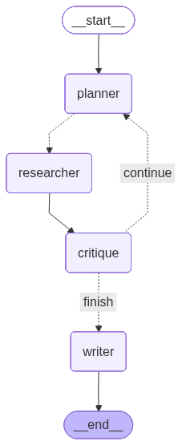

# Deep Research Agent

A deep research agent built with **LangGraph** that accepts a user query, searches the web for relevant sources, iteratively refines its research, and produces a grounded report with citations.



## Architecture

```
User Query → Planner → Researcher (parallel) → Critique → Writer → Report
                 ^__________________________|
                      (if insufficient)
```

- **Planner** — Breaks the query into targeted search queries
- **Researcher** — Executes searches in parallel using Tavily (with DuckDuckGo fallback)
- **Critique** — Evaluates whether gathered data is sufficient; loops back to Planner if not
- **Writer** — Generates a cited report in the user's chosen format

## Setup

### 1. Clone and install

```bash
git clone https://github.com/your-username/Deep-Researcher.git
cd Deep-Researcher
pip install -r requirements.txt
```

### 2. Configure environment variables

Create a `.env` file in the project root:

```
GROQ_API_KEY=your-groq-api-key
OPENAI_API_KEY=your-openai-api-key
TAVILY_API_KEY=your-tavily-api-key
LANGSMITH_API_KEY=your-langsmith-api-key
LANGSMITH_PROJECT=deep-researcher
LANGSMITH_TRACING=true
```

- **Groq** or **OpenAI** — at least one LLM provider key is required
- **Tavily** — recommended for web search (falls back to DuckDuckGo if not set)
- **LangSmith** — optional, for tracing and evaluations

### 3. Run the application

Start the FastAPI backend and Streamlit frontend in two separate terminals:

```bash
# Terminal 1 — API server
python main.py

# Terminal 2 — UI
streamlit run app.py
```

The API runs at `http://localhost:8000` and the UI at `http://localhost:8501`.

## Configuration

All settings are configurable from the Streamlit sidebar:

| Setting | Options | Default |
|---------|---------|---------|
| LLM Provider | OpenAI, Groq | OpenAI |
| Report Style | Detailed, Concise, Academic, Bullet Points | Detailed |
| Number of searches | 1–5 | 3 |
| Max iterations | 1–3 | 2 |
| Results per search | 1–5 | 3 |

Defaults can also be changed in `config/config.yaml`.

## Report Styles

- **Detailed** — Executive summary, key findings, detailed analysis, limitations, references
- **Concise** — Short overview with 3–5 bullet takeaways (under 500 words)
- **Academic** — Abstract, introduction, methodology, findings, discussion, conclusion, references
- **Bullet Points** — Grouped bullet points with no prose paragraphs

## Evaluations

LangSmith evaluations are in the `evals/` folder:

```bash
# Run evaluations
python -m evals.run_evals

# Generate graph diagram
python -m evals.generate_graph
```

Evaluators check for: citation presence, report length, markdown structure, and error-free completion. Results are viewable in the LangSmith dashboard.

## Project Structure

```
├── agent/               # LangGraph workflow
├── config/              # YAML configuration
├── evals/               # LangSmith evaluations
├── logger/              # Logging setup
├── models/              # Pydantic data models
├── prompt_library/      # LLM prompt templates
├── tools/               # LangChain tool wrappers
├── utils/               # Config loader, model loader, web search
├── app.py               # Streamlit frontend
├── main.py              # FastAPI backend
└── requirements.txt
```
